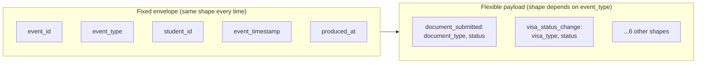
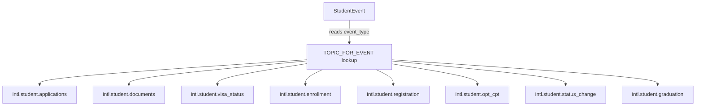
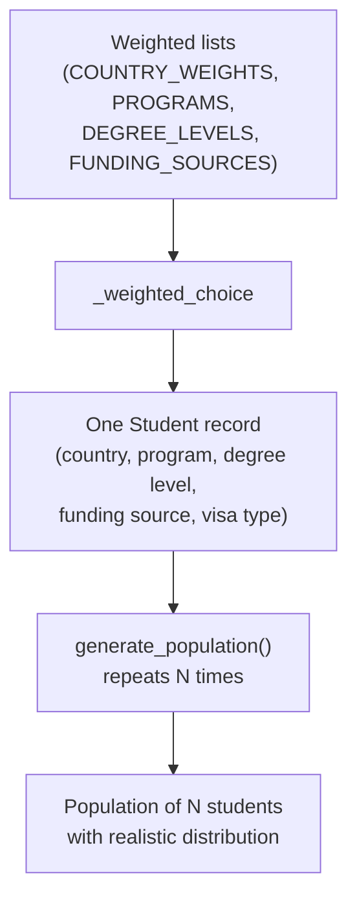
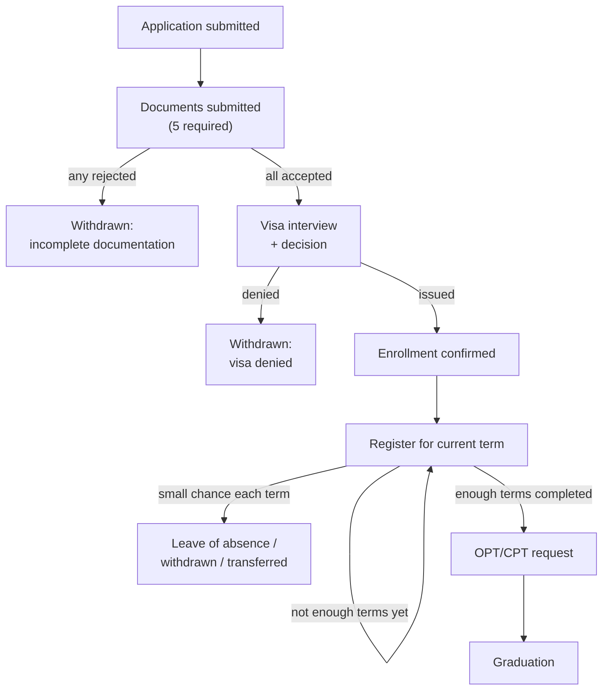

# Data generator — how it works

This covers the three files that make up the synthetic data generator: `schemas.py`, `population.py`, and `lifecycle.py`. Each section has a diagram of the core logic plus a short explanation of why it's built that way.

## schemas.py — the event vocabulary

Every event shares one fixed envelope. The envelope's shape never changes; only the payload inside it does, depending on which of the eight event types it is.

The envelope/payload split exists so anything downstream (Airflow, Spark) can handle all eight event types with identical code by reading the envelope, and only needs type-specific logic when it actually cares what's inside the payload.

Each event also knows its own destination. The `event_type` is looked up in a single dictionary (`TOPIC_FOR_EVENT`) to find which Kafka topic it belongs to, so the routing logic lives in exactly one place instead of being hardcoded everywhere an event gets sent.

## population.py — the student blueprint

Before anything happens to a student, this file decides what a student *is*: a fixed snapshot of attributes like country, program, degree level, and funding source. Realism comes from weighted random choices instead of uniform ones, India and China should be far more likely than Kyrgyzstan, not equally likely.

`_weighted_choice` exists because `random.choices()` needs two separate parallel lists (the options, and their weights), but the data is naturally stored as bundled pairs for readability. The function's only job is splitting the bundle into the two lists the random function actually requires.

## lifecycle.py — the student's journey

This is the file that decides what *happens* to each student over time, and the core idea is branching: not every student makes it to graduation. There are three points where a student's story can end early, plus one finish line.

Each exit point (`X1`, `X2`, `X3`) is a real `status_change` event the function generates before returning immediately, no further events get created for that student once they've exited. The term registration loop is the one part that can repeat multiple times per student rather than happening once, since a student registers every term they're active, not just a single time.

This branching is what makes the dataset useful for funnel analysis later: the curated tables will be able to show real drop-off rates at each stage (document rejection rate, visa denial rate, mid-program attrition rate) instead of a fake dataset where everyone sails through to graduation.
